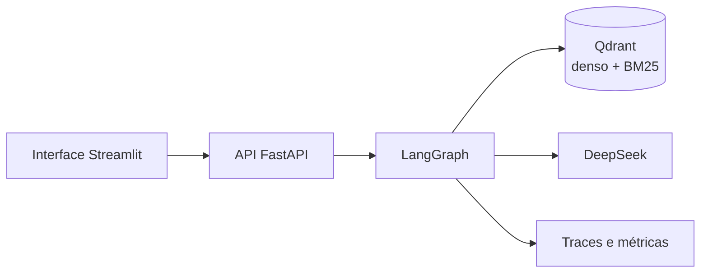
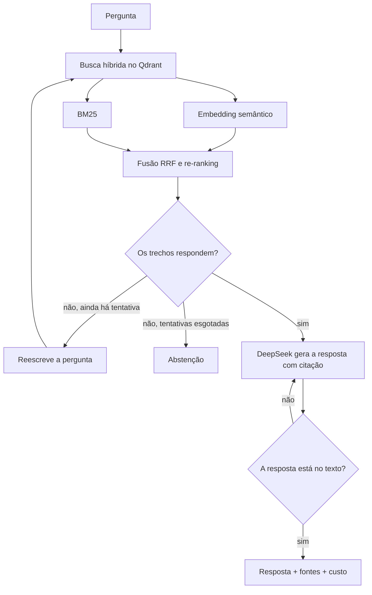

# Copiloto financeiro — Rede Aurora Cosméticos

Sistema de perguntas e respostas sobre a documentação financeira da Rede Aurora Cosméticos, uma rede fictícia de franquias. A pergunta entra em português; a resposta volta com o trecho do documento que a sustenta. Se o assunto não estiver na base, o sistema avisa que não encontrou — não inventa taxa, prazo nem alíquota.

**Demo:** [https://optical-predicted-weekend-affiliate.trycloudflare.com](https://optical-predicted-weekend-affiliate.trycloudflare.com)

---

## De onde vêm as respostas

O índice cobre 10 documentos da operação financeira da rede (políticas, manuais, tabelas, DRE, contrato e relatórios). Tudo está em [`data/corpus`](data/corpus):

| Documento | Conteúdo |
|---|---|
| Política de conciliação de cartões | Regras de conciliação PDV × adquirente × conta, tolerância de divergência, chargeback |
| Tabela de MDR por bandeira e adquirente | Taxas Visa, Mastercard e Elo na Alfa e na Beta, à vista e parcelado |
| Manual de fluxo de caixa do franqueado | Categorias de entrada/saída, capital de giro, projeção de 30 e 90 dias |
| DRE gerencial consolidado 3T2025 | Receita, custos, EBITDA e comentários do trimestre |
| Política de royalties e fundo de marketing | Base de cálculo, alíquotas, vencimento, desconto por desempenho |
| Procedimento de fechamento mensal | Calendário, checklist e regras de reabertura |
| Relatório de conciliação bancária — set/2025 | Divergências do mês e um caso de MDR da Beta |
| Glossário financeiro | Definições usadas na rede (MDR, EBITDA, chargeback, etc.) |
| Política de inadimplência de franqueados | Atraso, cobrança, renegociação e garantias |
| Contrato de credenciamento ADQ-4471 | SLA, volume mínimo, liquidação e antecipação com a Adquirente Alfa |

Uma pergunta como “qual o MDR do Visa crédito na Alfa?” cai na tabela de tarifas. “Qual a tolerância da conciliação?” cai na política. “Qual foi o EBITDA de setembro?” cai no DRE.

---

## Arquitetura

O sistema é um RAG corretivo: a busca, a geração e a decisão de responder ou recusar são etapas explícitas de um grafo, não um único prompt.

Fluxo de uma pergunta:

A ingestão (chunking que preserva tabela e título, embeddings locais via fastembed e gravação no Qdrant) roda na subida da API. O código correspondente está em `src/finrag/ingestion`, `retrieval` e `graph`.

Na interface a rota aparece como resposta direta, consulta reescrita, resposta refeita ou abstenção.

---

## Ferramentas

| Camada | Ferramenta |
|---|---|
| Linguagem | Python 3.12 |
| Orquestração do fluxo | LangGraph (LangChain) |
| LLM | DeepSeek (`deepseek-v4-flash`), API compatível com OpenAI |
| Embeddings e BM25 | fastembed (ONNX, local) |
| Banco vetorial | Qdrant (vetor denso + esparso) |
| API | FastAPI + SSE |
| Interface | Streamlit |
| Observabilidade | log estruturado (structlog), traces e métricas no formato Prometheus |
| Empacotamento | Docker Compose |
| Testes | pytest, ruff, mypy |

O código principal está em `src/finrag`: ingestão e chunking em `ingestion/`, busca em `retrieval/`, grafo em `graph/`, API em `api/`.

---

## Avaliação

Rodei 35 perguntas de gabarito (`evals/golden_dataset.jsonl`) contra o índice. Resultado em `reports/eval-latest.json`:

- 94,3% das perguntas aprovadas
- o documento esperado apareceu na recuperação em 97,1% dos casos
- os fatos obrigatórios (taxas, prazos, nomes) saíram na resposta em 95,7% dos casos
- custo médio por pergunta: US$ 0,0042

Treze perguntas só fecharam depois de o fluxo reescrever a consulta.

---

MIT
